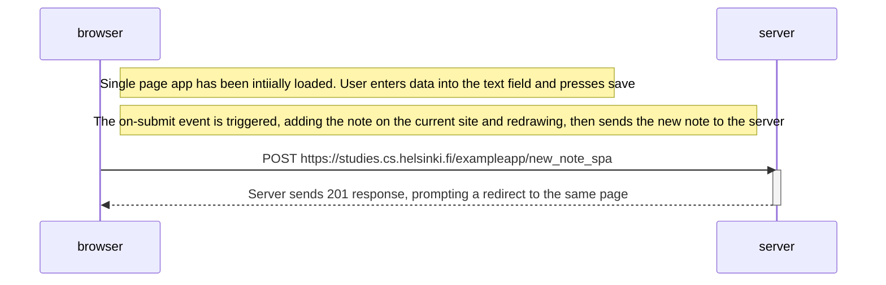

```mermaid

sequenceDiagram
    participant browser
    participant server

    Note right of browser: Single page app has been intiially loaded. User enters data into the text field and presses save

    Note right of browser: The on-submit event is triggered, adding the note on the current site and redrawing, then sends the new note to the server

    browser->>server: POST https://studies.cs.helsinki.fi/exampleapp/new_note_spa
    activate server
    server-->>browser: Server sends 201 response, prompting a redirect to the same page
    deactivate server


```